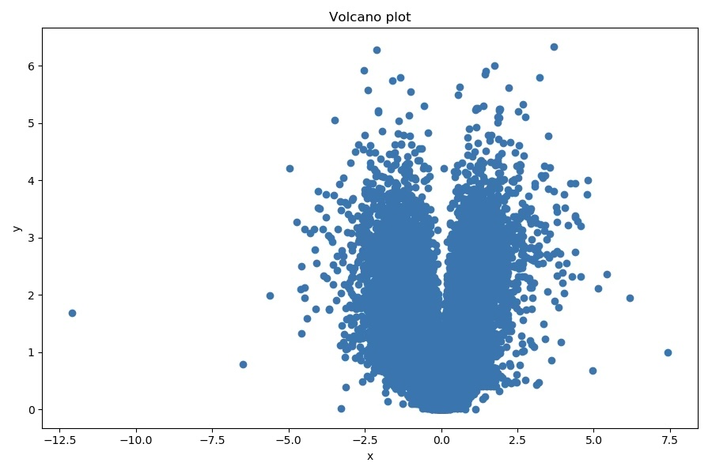
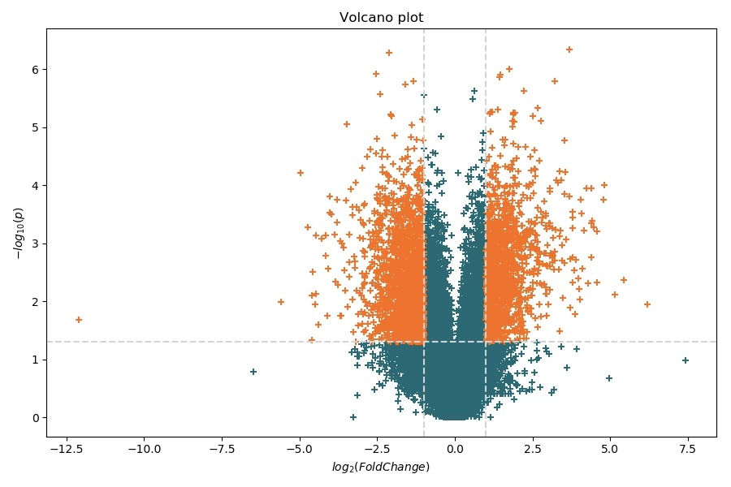
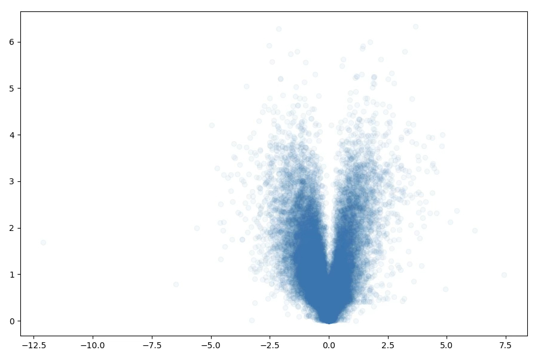
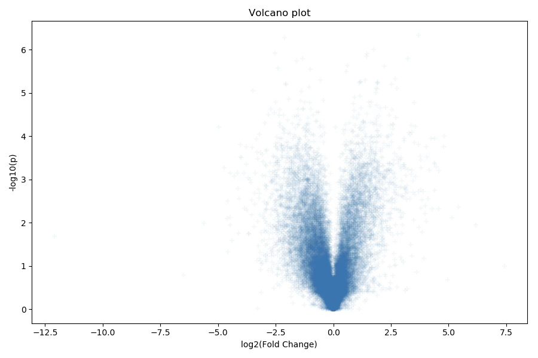

<style>
[data-bs-theme=dark] img.dark-filter.figure {
  filter: none !important;
}
</style>

:::::::::::::::::::::::::::::::::::::: questions 

- How can we read in more complex, tabular data?
- How can we filter and transform the data?
- How can we make more complex plots?

::::::::::::::::::::::::::::::::::::::::::::::::

::::::::::::::::::::::::::::::::::::: objectives

- Learn how to split bits of data and transform them 
- Learn how to use the numpy library
- Learn how to make a scatter plot with complex styling

::::::::::::::::::::::::::::::::::::::::::::::::

## More Complex Data

In the previous worksheet, we loaded simple data (just a list of numbers) from a file and made single plots. But this dataset is more complicated. We will need to process the data in various ways to get them into a format that Python can plot. In real data sets, it is very common to have to do this kind of processing.

This is a large data file, containing over 25,000 lines, and converting data into standard formats suitable for plotting and analysing is a large part of data analysis work, and one of the tasks Python excels at. The data in this file come from an RNA sequencing (RNA-Seq) experiment, and we are going to draw a "volcano plot" of this data. This plot displays a point for each gene, showing the fold change in expression between two experimental conditions on the x-axis, and the p-value on the y-axis.

At their simplest, they look like the one below on the left, but we will produce something more like the one on the right, which gives a bit more information about what is happening in the experiment. You don't have to worry about the details of the experiment, but we are more than happy to chat about it if you are interested - the important thing here is to learn how to handle the data in Python, and how the matplotlib module allows you to present the data.

{alt="Volcano plot"}
{alt="Customised volcano plot"}

This may sound daunting at first look, but you have already done most of what we need to do to process the data, it’s just a case of bringing lots of methods together from the first three worksheets.

## Reading in the Data

You should have already downloaded the file containing the data (`rna_seq_data.txt`) from [https://github.com/sandyjmacdonald/intro-python-course](https://github.com/sandyjmacdonald/intro-python-course). Again, make sure that it is moved into the same folder where you have been saving your Python programs. We will start simple, just by opening the file at the Python shell.

```python
f = open('rna_seq_data.txt', 'r')
```

## Loading the Data

If you open the file in a text editor (we like Sublime Text), you will see that it consists of a large number of lines (>25,000) with several values, which are separated by tab characters. You could also open the file in Excel, and you will see that there are four columns in there which have the headings “id”, “name”, “pvalue” and “logFC”. These are the ID of the gene, gene name, p-value (probability of getting this result by chance if there is no change in gene expression between the two conditions) and the log2 fold-change difference in gene expression.

::::::::::::::::::::::::::::::::::::: challenge

## Reading Through the File

Start by creating a new Python program, then add the basic code to open and read through the file, printing out each line, exactly as we did in Episode 3, but obviously replace the filename with the name of the file above. You will notice that there is a header line in the file, which contains the names of the data fields on each line, and you will need to get rid that line first using `.readline()`, before the `for` loop.

Once that is working, add a couple of imports to the top of the file that we will need later. The first is for `numpy`, which makes processing the data a bit easier, and the second is for `matplotlib`, which we will use for plotting the data. You can import them as follows:

```python
import numpy as np 
import matplotlib.pyplot as plt
```

:::::::::::::::: solution

```python
import numpy as np 
import matplotlib.pyplot as plt

f = open("rna_seq_data.txt", "r")
header = f.readline()

for line in f.readlines():
    print(line)
```

:::::::::::::::::::::::::
:::::::::::::::::::::::::::::::::::::::::::::::

## Splitting the Lines and Converting the Data

The next step is to strip the newline characters from the end of the lines, then split the lines into the individual strings which represent the values that we need. Again, we have done this before using the `.strip()` and `.split()` methods in Episode 2, but it is common in Python to chain these sort of calls together. When you call `.strip()` on a string, it returns a new string object, which has its own methods, so you can treat e.g., `line.strip()` as if it is itself a string, so you can call its `.split()` method directly. This avoids having to store the results of `.strip()` separately, before then calling `.split()`. Since we know the values on each line of our data file are separated by tab characters, we can do this (inside the `for` loop) with:

```python
values = line.strip().split("\t")
```

For the purposes of this worksheet, we are only really interested in the third and fourth columns of the file (so, `values[2]` and `values[3]`). Remember that these are still strings which represent numbers, and not the actual numbers, so they need to be converted. In Episode 3, we did this using the `int()` function, but these numbers are not integers, so we need to convert them to "floating point" numbers using `float()` instead, so after the lines have been split, you can get the p-value and log2 fold change using:

```python
p_value = float(values[2])
log_fold_change = float(values[3])
```

::::::::::::::::::::::::::::::::::::: challenge

## Putting Together a Single Script

Take the code from the last challenge that opened a file and read through its lines, and add in the code from above to split the lines and store the p values and log fold change. Make your code print the p value and log fold change values for each line.

:::::::::::::::: solution

```python
import numpy as np 
import matplotlib.pyplot as plt

f = open("rna_seq_data.txt", "r")
header = f.readline()

for line in f.readlines():
    values = line.strip().split("\t")
    p_value = float(values[2])
    log_fold_change = float(values[3])
    print(p_value, log_fold_change)
```

:::::::::::::::::::::::::
:::::::::::::::::::::::::::::::::::::::::::::::

## Building Lists of the Values

So, now we know how to read through the file, split the lines into separate values, and convert the values to the correct data type, but what we need to do is plot the data as a volcano plot. This is just a scatter plot, and the matplotlib function that draws scatter plots needs us to pass in two lists, one for the x-coordinates of each point and one for the y-coordinates. That means that we have to have to store our p-values in one list and the corresponding log2 fold-changes in another.

::::::::::::::::::::::::::::::::::::: challenge

## Storing Values for Later

Build on your code from the last challenge, to:

* Create empty lists for the p-values and log2 fold-changes (before the `for` loop)
* Add each p-value and log2 fold-change to the correct list when you convert them (for each line, so inside the `for` loop)

:::::::::::::::: solution

```python
import numpy as np 
import matplotlib.pyplot as plt

f = open("rna_seq_data.txt", "r")
header = f.readline()

p_values = []
log_fold_changes = []

for line in f.readlines():
    values = line.strip().split("\t")
    p_value = float(values[2])
    p_values.append(p_value)
    log_fold_change = float(values[3])
    log_fold_changes.append(log_fold_change)
```

:::::::::::::::::::::::::
:::::::::::::::::::::::::::::::::::::::::::::::

## Plotting the Data

Now we are almost ready to actually plot the data, but not quite. A volcano plot shows, for each gene in the dataset, the relationship between its change in expression between conditions (the fold-change) and the statistical significance level (p-value) that indicates how likely it is that the difference is "real". The fold-change values from the file were already log-transformed (to base 2), so that up-regulated genes have positive values and down-regulated ones have negative values (and unchanged genes have a value of zero).

For the p-values, the smaller the value, the more likely it is that the gene is really differentially expressed, and the normal way to plot them is to plot the negative of the log (to base 10), so that the more significant genes appear at the top of the plot (smaller p-values turn into larger values on the y-axis). This means that we have to transform the values we read from the file. We could have done this as we read the data, then store the transformed values. Another approach would be to use a `for` loop to transform each p-value in turn. However, we have already imported the `numpy` module which, amongst other things, is really convenient for doing these sorts of transformations. All we need to do is:

```python
log10_p_values = -np.log10(p_values)
```

and the whole list is log transformed!  (It actually now has a new data type as well, but we don't need to worry about that right now... it will still behave just like a list). So now we can plot the data. The simplest way to do that is the two lines:

```python
plt.scatter(log_fold_changes, log10_p_values)
plt.show()
```

which should bring up a window containing a plot that looks like this:

{alt="Volcano plot"}

This is fine as far as it goes, and you can see some features of the data. For example, it looks like most of the data is clustered around x=0, and most of the points have small -log10(p) values, which indicate they are not likely to be significant.

One technique that can be used to emphasise this is to make each of the points slightly transparent. The parameter that does this in the call to `plt.scatter()` is called `alpha`, and you give this a value to specify how opaque each spot is, and it can take values from 0 (transparent) to 1 (entirely non-transparent). Intermediate values make the point look lighter in colour, but the colour becomes darker as more points overlap.

To try this and have a look at how it might help, you just need to change your call to `plt.scatter()` to be like this:

```python
plt.scatter(log_fold_changes, p_values, alpha=0.05)
```

which makes the plot look like this:

{alt="Volcano plot with transparency"}

We should, of course, also label the axes, and provide a title for the graph. We can do this by inserting these three lines, just before call to `plt.show()`:

```python
plt.xlabel("log2(Fold Change)")
plt.ylabel("-log10(p)")
plt.title("Volcano plot")
```

{alt="Volcano plot with annotations"}

## Splitting Data

That is starting to look like a decent volcano plot now, but it doesn’t explicitly show the genes that we think are interesting from the point of view of our experiment. It would be nice if we could draw the significant data points in a different colour, or with a different marker. To do that, we need to know two things. First, if you call `plt.scatter()` more than once, before you call `plt.show()`, but with different lists of coordinates, both sets of points will be plotted on the same set of axes. You can even mix different graph types on the same set of axes, if you think that is a sensible thing to do. Second, `plt.scatter()` has a huge number of parameters that you can pass in to affect the points, including their colour, whether they have a line around them, how thick that line is, what shape of marker you want to use, and so on.

For these data, we just want to display the significant points using a different colour. To do that, though, we need to have those points in different lists from the rest of the points, so we can call `plt.scatter()` again, but specify a different colour. To do that, we need to create two new lists, maybe called `sig_p_values` and `sig_fold_changes`, to hold them. Then, as we read the lines from the file, when we have suitable values, add them to those lists, instead of the `p_values` and `log_fold_changes` lists. In this case, suitable means that the p-value is less than 0.05, and the log2 fold change is either greater than 1 or less than -1.

::::::::::::::::::::::::::::::::::::: challenge

## Conditional Lists

Let's take our code from the last challenge and add in some conditions to decide which lists to add values to:

* Create new lists to hold the p-values and log2 fold changes for the "significant" genes, before the for loop
* Inside the `for` loop, after converting the values to floats, put in an `if` statement to decide whether to add the values to the significant or non-significant lists
* The conditions you need are that the p-value must be less than 0.05 _and_ the log2 fold-change must be greater than 1 or less than -1 (**tip**: look into the `abs()` function...)
* Remember, you will need to do the negative log10 transform on the two lists of p-values after the loop

:::::::::::::::: solution

```python
import numpy as np 
import matplotlib.pyplot as plt

f = open("rna_seq_data.txt", "r")
header = f.readline()

p_values = []
sig_p_values = []
log_fold_changes = []
sig_fold_changes = []

for line in f.readlines():
    values = line.strip().split("\t")
    p_value = float(values[2])
    log_fold_change = float(values[3])
    if p_value < 0.05 and abs(log_fold_change) > 1:
        sig_p_values.append(p_value)
        sig_fold_changes.append(log_fold_change)
    else:
        p_values.append(p_value)
        log_fold_changes.append(log_fold_change)

log10_p_values = -np.log10(p_values)
log10_sig_p_values = -np.log10(sig_p_values)
```

:::::::::::::::::::::::::
:::::::::::::::::::::::::::::::::::::::::::::::

## Re-plotting the Data

So, now the data is split into two pairs of lists (p-values and log2 fold changes for significant and non-significant genes), you can plot them separately with these commands:

```python
plt.scatter(log_fold_changes, log10_p_values, c='blue', marker='+')
plt.scatter(sig_fold_changes, log10_sig_p_values, c='red', marker='+')
```

There are many many different options for the marker symbols; you can look at the matplotlib documentation to find an exhaustive list. Similarly, there are a large number of ways to specify the colour that you want the data points to be. You can specify an HTML colour name (Google to find a very long list of possibilities), or hexadecimal RGB values. matplotlib also has a submodule which is just designed to handle colour specifications, which has several other options. If you want to reproduce the plot as it appears at the top of this Episode, you can replace "red" and "blue" with "#006B77" and "#FF6900", which will change your data points into colours that are officially approved as part of the University’s Brand Identity.

## Finishing Touches

This worksheet has covered the basics of data manipulation and plotting in Python. There are a couple more things that are probably worth mentioning before we finish.

In the plot at the top of the Episode there are horizontal and vertical lines on the plot to indicate the thresholds that we used for the log2 fold-change and p-value. These are added with `plt.axhline()` for horizontal lines, and `plt.axvline()` for the vertical lines. They also take a wide range of parameters to specify the line colour, thickness, whether the line is dotted, dashed, or solid, etc. If you have a Python session with matplotlib loaded, you can type `help(plt.axhline)` in the Python console to get a full description.

Finally, anywhere in matplotlib that includes any kind of text (such as the axis labels and the plot title) can also include mathematical notation. If you are familiar with TeX or LaTeX, you can use the same syntax and it will just work. For example, if you replace the text in the `plt.xlabel()` call with `"$\log_{2}(FoldChange)$"`, you will see that the new text is in italics and the 2 is a subscript, as it should be. Try it yourself, and aim to get the 10 on the y-axis label in subscript also.

{alt="Final volcano plot"}

## Summary

* Python modules provide additional functionality for the language, and can perform many common data analysis tasks
* Reading data from files, and converting it into a format suitable for visualisation is one of the most common tasks that Python is used for. As you might expect, there are also modules which can help you out with it, such as “pandas”, which allows you to load data files like the one we used in the workbook directly into an R-like data frame and has a bunch of functionality for working with large tabular datasets.
* numpy allows you to used "vectorised" or "broadcast" operations, which operate on all elements of a data structure, such as a list. It actually returns a copy of a data structure we haven’t discussed yet, an n-dimensional array (or ndarray). All normal operations, such as addition, multiplication, etc., automatically operate on all elements of an ndarray. For those familiar with R, this is analogous to R’s vector data type.
* This is a tiny part of the numpy module, which implements a large number of numerical operations, such as matrix and linear algebra
* Note that for real exploration of RNA-seq data, rather than just using the p-value, you should take into account that many tests have been done (i.e., one for every gene), so some kind of multiple testing correction should be applied to the results. We often do this using the Benjamini-Hochberg False Discovery Rate (FDR). The statsmodels package contains lots of methods for multiple testing, including fdrcorrection for calculating FDRs ([documentation for this function is available here](http://www.statsmodels.org/stable/generated/statsmodels.stats.multitest.fdrcorrection.html)).