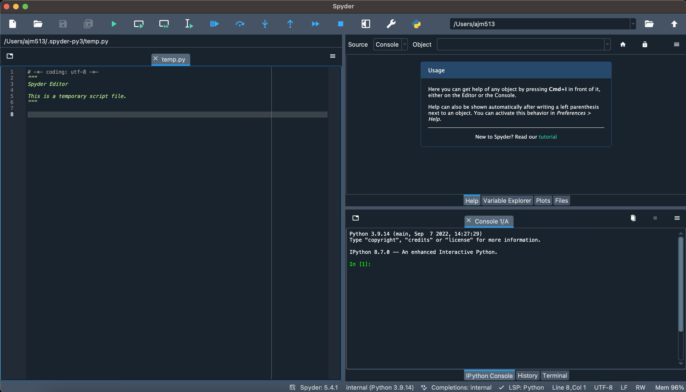

:::::::::::::::::::::::::::::::::::::: questions 

- Do you know what a variable in Python is?
- What are data types and how can we use them?
- How can we work with sequences of data in Python?

::::::::::::::::::::::::::::::::::::::::::::::::

::::::::::::::::::::::::::::::::::::: objectives

- Learn how expressions work and how their results can be assigned to a variable
- Explore some basic data types: numbers, strings, and lists
- Discover what "objects" are and how methods work on those objects
- Begin to work with sequential data types like lists

::::::::::::::::::::::::::::::::::::::::::::::::

## Running Python

Python itself normally exists just to run programs that you have written, but it can run as a program in its own right, allowing you to explore the language by typing commands which it then executes for you. Quite a lot can be done at this command prompt, but to do anything serious you will need to start creating your programs in a text editor and executing them with Python. However, we will start by looking at what you can do at the Python prompt.

Python is already installed on the computers in this room (and hopefully on your own machine now) and there is an Anaconda Python program group containing a number of items (`Start Menu->All Programs->Programming Tools->Anaconda 3 (64-bit)`). The two which concern us at the moment are "Spyder" and, maybe, "Anaconda Prompt". For the moment, click the Spyder icon and a window like the one below should appear. If you are not using Anaconda Python, the distribution that you install should have at the very least an IDLE icon in its program group, which will present a window which will allow you to enter Python statements in a similar way.



This might look daunting at first sight, but for the moment, you just need to concentrate on the panel in the lower right of the screen, that has the title "Console...". If you click in this pane, next to the `In [1]:` prompt, you should get a flashing cursor, and you can start typing Python commands. It might help for the moment, to drag the dividers the top and left of this pane to make it larger.

::::::::::::::::::::::::::::::::::::: challenge 

## Hello, World

As is traditional under these circumstances, the first thing you should do is get Python to print out the text "Hello, World". To do this type:

```python
print("Hello, World")
```

at the Python prompt and press return. Barring the odd typing mistake you have just run your first Python script. Here, `print` is a Python function that tells the interpreter that you want it to output the things which follow in the brackets. The `"Hello, World"` is a string and is what you want the print function to print out.

:::::::::::::::::::::::: solution 

## Output
 
```output
'Hello, World'
```

:::::::::::::::::::::::::::::::::
::::::::::::::::::::::::::::::::::::::::::::::::

## Experimenting with the Python Shell

The Python shell (which is what you are using now) is a great way to experiment with Python. It’s something that I return to every time I find myself thinking “I wonder what happens if you do this?” or “what’s the best way to do that?”. You can’t break anything by trying something and if you make a mistake at least you will get an error message that you might be able to decipher.

You are not limited to what you can do at the prompt. You can load modules, look at them to see what they do, play with them. The first versions of the bar charts in Worksheet 4 were all produced at the Python prompt, which enabled me to tweak them to see exactly how I wanted them before writing the program to produce the whole figure. This meant I could see how they looked after every command and get them looking just as I wanted. I could also check the documentation for the modules I wanted to use by typing `help()`. There is a lot of information in there and you will find yourself using it again and again.

The only thing you can’t do, though, is save what you have done, but in Spyder, you just need to click in the Editor pane on the left of the Window, then you can edit a program, then save and run it; we’ll see how to do that in Worksheet 2. When you want to use Python on your own computer, I recommend that you install Anaconda Python, which comes with almost all of the modules you will ever need pre-installed (and makes it simpler for you to install others). You can also install Anaconda on both Mac and Linux as well, and it would be worth it if you are planning on using some of the more complex modules like numpy and matplotlib.

## Evaluating Expressions

The Python shell can also be used to evaluate expressions, allowing you either to perform calculations interactively, or more usually to check more complicated expressions interactively before putting them in your programs. Python allows you to do all of the normal operations, in pretty much the way you would expect.

Have a go with some expressions, such as:

```python
3 * 4     # Multiplication
7 + 10    # Addition
7 - 10    # Subtraction
10 / 2    # Division
```

So far, so good, but don’t limit yourself to the examples here. Try some of your own and make sure you understand the results. There are a few other operators, though, which you might not be as familiar with.

Try these:

```python
10 % 7    # Modulus (remainder)
2 ** 10   # Exponentiation (2 to the power of 10)
```

Again, as expected. However, there are a few things that you need to be aware of when using arithmetic in any programming language. In many languages, if your numbers are integers, they will return an integer (whole number) value, and this was the case in Python up to version 3. Now, though, Python 3 returns the correct floating point (decimal number) value.

So try:

```python
10 / 7
```

Here you should get the answer 1.428571…  This may or may not be what you want, but if you want to get just the integer result in the first place, you can force Python to give you that as well using so-called "floor division":

```python
10 // 7
```

When you installed Python, I told you to use the 64-bit version, and you might think this limits you in the size of the numbers you can deal with. In theory, a 64 bit computer can (easily) store numbers up to:

```python
2 ** 64
```
Python can deal with numbers slightly larger than this, though so the following works just fine:

```python
2 ** 1024
```

 Raising 2 to the power of 1 million starts to tax Python though, but perhaps not in obvious ways:

 ```python
 2 ** 1000000
 ```

::::::::::::::::::::::::::::::::::::: challenge

## Large Numbers

Q: What is the practical limit in terms of the size of numbers that can be stored?

:::::::::::::::: solution

A: You can get Python to store numbers up to `2 ** 1000000000` (2 to the power of 1 billion) fairly easily, but Python will give you a `ValueError` if you try to print out stored numbers that are more than 4,300 digits long, e.g.:

```python
a = 2 ** 16384
print(a)
```

```output
ValueError: Exceeds the limit (4300 digits) for integer string conversion; use sys.set_int_max_str_digits() to increase the limit
```

:::::::::::::::::::::::::
:::::::::::::::::::::::::::::::::::::::::::::::

Some of these operators don’t just work on numbers, `+` and `*` can be used on strings as well. Strings are just sequences of characters enclosed in quotation marks like the `Hello, World` above. Python doesn’t mind if you use single or double quotes as long as you don’t mix them (not strictly true, but ask if you want to know the details..)  “Addition” concatenates two (or more) strings together to return a new, longer string. “Multiplication”, actually repetition, takes a number and a string and repeats the string that many times in a new string:

```python
'Hello, ' + 'world!'
'Hello' * 8
9 * 'Hello...'
```

::::::::::::::::::::::::::::::::::::: challenge

## Mathematical Expressions

Try to use expressions that you would use in your normal work and see if they give the results you expect. Explore using brackets to group sub-expressions: things in brackets are always evaluated before everything else. Remember BODMAS (or BIDMAS)?

Before you move on to the next section, use a single expression to calculate the length of the hypotenuse of a right angled triangle where the lengths of the other sides are 12 and 5, using Pythagoras’ Theorem.

:::::::::::::::: solution

Raising a number to the power of 0.5 is the same as calculating its square root.

You must calculate the squares of the other two sides in separate pairs of brackets, and then wrap the addition in another pair of brackets before raising to the power of 0.5:

```python
((12 ** 2) + (5 ** 2)) ** 0.5
```

```output
13.0
```

:::::::::::::::::::::::::
:::::::::::::::::::::::::::::::::::::::::::::::

## Using Variables

So far, we have just been playing with what Python calls values. When you are writing programs, it’s useful to be able to give names to the values that we are dealing with so that once we do a calculation or string manipulation we can refer to the results later. We do this with an assignment statement which looks like this:

```python
x = 3
```

You’ll notice when you type this, that Python doesn’t return anything, and this is also true if you capture the result of one of the expressions that we tried above:

```python
y = 10 / 7
```

To look at the values, just type:

```python
x
y
```

```output
>>> x
3
>>> y
1.4285714285714286
```

More normally, you would probably output the results using the print statement we started with:

```python
print(x, y)
```

```output
3 1.4285714285714286
```

As well as being on the left of an assignment operation, variable names can be used in the expressions as well so:

```python
x = x + y
```

This replaces the value currently referred to as x with the new value obtained from adding the values of x and y. Variables that refer to numbers are fine and are incredibly useful, but they are also one of the less interesting types of Python data. This is because they only have a value. Some variables are much more interesting, and string variables are a good example.

To assign a string to a variable you can do something like:

```python
s = "The quick brown fox jumps over the lazy dog"
```

Again, you can just type the variable name or use it in a print statement, but what makes a variable containing a string more interesting is that it is one of Python’s object data types. This means that it doesn’t just passively hold the value of the string, it knows about things you can do to the string.

For example:

```python
s.upper()
```

```output
'THE QUICK BROWN FOX JUMPS OVER THE LAZY DOG'
```

The `.` here indicates that the method belongs to the string object s, and the brackets indicate that we want to execute it. Here the brackets are empty, but later we will be using them to pass information into the methods. There are many things that strings can do with themselves, and if you look at the Python cheat sheet, you will see what they all are.

Try using them on the string, for example:

```python
s.capitalize()
s.title()
```

```output
>>> s.capitalize()
'The quick brown fox jumps over the lazy dog'
>>> s.title()
'The Quick Brown Fox Jumps Over The Lazy Dog'
```

If you look at `s` itself after any of these, you’ll see it hasn’t changed. These object methods simply return a new version of the string with the appropriate transformation done to it which you can then store in another variable (or back in `s`) if you want to. This is because a string cannot be changed in place (in technical terms, it is "immutable"), only overwritten with a new value. So to save the new version of the string, you can type:

```python
s = s.title()
```

You can use almost any combination of letters and numbers in the variable names, but there are a few rules: you can’t start a variable name with a number, and you can also include underscore characters. Variable names can also begin with underscore, but these tend to be used under special circumstances which you will discover once you start learning about object-oriented programming.

::::::::::::::::::::::::::::::::::::: challenge

## String Methods

Use the `.count()` method on the string `"The quick brown fox jumps over the lazy dog"` to count the occurrences of the word `"the"`. If this returns 1, how could you persuade it that it should be 2?

Once you have that sorted out, try the following and understand what it has done.

```python
s.split()
```

:::::::::::::::: solution

The following does indeed return 1, because only the exact string `"the"` is matched.

```python
s.count("the")
```

```output
1
```

You can, however, use the `.lower()` method first to convert the string to lower case, and then chain on the `.count()` after.

```python
s.lower().count("the")
```

```output
2
```

The `.split()` function will split a string using any white space between characters as the delimiter by default, returning a list of the split string items. You can also pass in a delimiter of your choice, e.g. `"apple,banana".split(",")` to split by commas.

```python
s.split()
```

```output
['The', 'quick', 'brown', 'fox', 'jumps', 'over', 'the', 'lazy', 'dog']
```

:::::::::::::::::::::::::
:::::::::::::::::::::::::::::::::::::::::::::::

## Lists

The last exercise returned a result which you might think looks unusual.

```python
s = "The quick brown fox jumps over the lazy dog"
s.split()
```

```output
['The', 'quick', 'brown', 'fox', 'jumps', 'over', 'the', 'lazy', 'dog']
```

This result is in the form of a list. A list is exactly what you would expect. It’s a set of values (which can be numbers, strings, objects or even lists, but that is a bit advanced for now) which are kept in a specific order.

You can create a new list using the same format as the result above:

```python
shopping = ['bread', 'potatoes', 'eggs', 'flour', 'rubber duck', 'pizza', 'milk']
```

Like strings, lists are a type of object, and so they also have some methods associated with them, which you can use. However, unlike strings, these methods mostly change the list _in place_, rather than returning a new list.

So when you type:

```python
shopping.sort()
```

Python doesn’t return a value, but if you look at the list, you will see the order of the items has changed. This means that unlike strings, lists are mutable, and individual items and sets of items can be changed in place.

If you decide you want to add items to the list, you can do it with the `append()` method:

```python
shopping.append('mayonnaise')
```

If you feel it’s important enough to go at the top of the list, you can use `insert()` to insert the new item at a particular point and shuffle everything else up:

```python
shopping.insert(0, 'mayonnaise')
```

Removing items from the list is just as easy and you use `.pop()` to do that. If you don’t give it an index (position in the list, more on that in the next section), it will remove the last item in the list, otherwise it removes the item with the index you specify and shuffles everything else up to close the gap.

## Sequences

The two object types that we have talked about so far share a number of properties. Both strings and lists consist of ordered sets of data. In the case of strings these are simple characters.

In lists, the elements of the list can be anything. However, for both we might want to refer to a particular item or range of items in a string or list and we can do this easily:

```python
words = s.split()
print(words[3])
```

```output
fox
```
You will see that `'fox'` is actually the fourth word and this is just one of the things that computers do that you have to get used to.

The first element in a sequence has an index of 0, like so:

```python
print(words[0])
```

```output
The
```

This is referred to as zero-based indexing or offset numbering. It originates from programming languages where variables actually refer to the memory location of the start of the list, but has just become a convention.

Negative indices are assumed to be relative to the end of the array so:

```python
words[-1]
```

```output
dog
```

Of course, if we knew how long the sequence was, we could just use the index of the last element.

For any sequence data type, the function `len()` will tell us how many elements it has:

```python
len(words)
len(s)
```

```output
9
43
```

Since the sequences are indexed from zero, the last element, e.g., `words[-1]` is the same as `words[len(words)-1]`

::::::::::::::::::::::::::::::::::::: challenge

## Indices and Slices

There are a few quirks to list (sequence) indexing (apart from starting at 0), and I have tried to summarise these on the Python Cheat Sheet. Have a go with a few of the “Indices and Slices” and make sure you understand how they work.

Then, instead of trying them on a list, try them on a string.

Now, if you are really adventurous, try and print the third letter of the fourth word in the words list.

:::::::::::::::: solution

The 0-based indexing in Python takes a little getting used to but, once you do, your brain will automatically translate "real" positions into o-based indices.

```python
words[5]
words[-2]
```

```output
'over'
'lazy'
```

Slices let you access a range of values from sequence-type data, from a start index up to, but not including, an end index:

```python
words[3:6]
```

```output
['fox', 'jumps', 'over']
```

This gave us the 4th, 5th, and 6th words, or from index 3 up to, but not including the word at index 6.

You will learn more advanced indexing and slicing later...

:::::::::::::::::::::::::
:::::::::::::::::::::::::::::::::::::::::::::::

## Summary

- Python can calculate the results of a wide range of expressions, and print out the results.
- Variables can store results of calculations or simple values that we might need later.
- Variables refer to values. The values can be numbers (integer and floating point), strings or lists. We will soon see that there are other data types as well.
- Some data types are objects which have methods associated with them. These methods perform common and useful tasks on the values in the objects.
- Some data types are sequences which lets us access individual elements at will.
- Sequence data types allow us to step through the values in them, but to do that we need to take some first steps towards writing real programs...