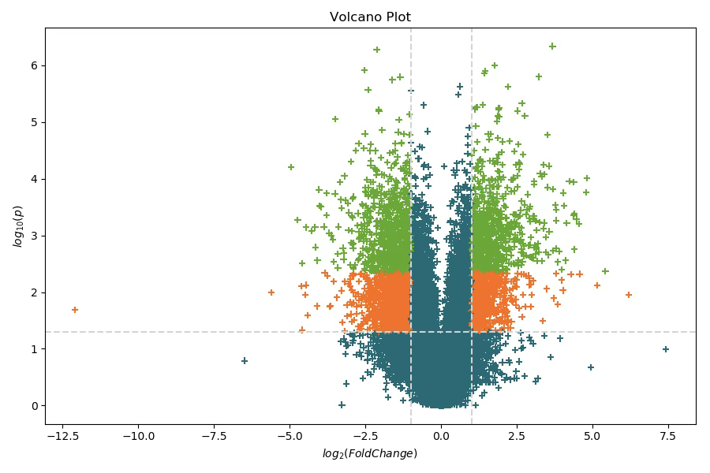

<style>
[data-bs-theme=dark] img.dark-filter.figure {
  filter: none !important;
}
</style>

:::::::::::::::::::::::::::::::::::::: questions 

- What more can we use Python for?
- Can we impvove our problem-solving with Python?

::::::::::::::::::::::::::::::::::::::::::::::::

::::::::::::::::::::::::::::::::::::: objectives

- Move beyond the basics we've learnt thus far
- Learn how to break down a problem and translate it to code
- Use Python for text analysis
- Use Python to retrieve data from the web

::::::::::::::::::::::::::::::::::::::::::::::::

This worksheet is not as structured as the others, and you don't need to work through all of the challenges below. Feel free to pick and choose the ones that are relevant to what you will be doing with Python. Many of the examples below use data files that are in the course's GitHub repository ([https://github.com/sandyjmacdonald/intro-python-course](https://github.com/sandyjmacdonald/intro-python-course)), and there may be more information there as well. 

_If you are dealing with different types of data in your work, and are not sure how to process that data in Python, let us know and we'll do what we can to point you in the right direction._

## Fizz Buzz

This shouldn't be that much of a challenge, but it's definitely worth you trying to get a solution to this. Why? Because this is the most commonly used programming task in job interviews. If reports on the internet are to be believed, up to 50% of people who apply for a coding job cannot complete it. If that is the case, it is (i) a bit worrying and (ii) a good way to make a really good impression at a job interview if you can complete it. So, what does it involve?

Fizz Buzz is a simple children's game (or elaborate student drinking game). A group of participants are sat in a circle, and they take turns to count. The first says one, the next says two, and so on. However, if the number you have to say is a multiple of three, instead of the number you say "Fizz", and if the number is a multiple of five, you say "Buzz". If the number is divisible by both 3 and 5, you say "Fizz Buzz". If the child fails to say Fizz, Buzz or Fizz Buzz at the appropriate time, or says them at the wrong time, they are out. The game continues until there is only one child left, or the patience of the adult who thought this was a good idea is exhausted.

The programming equivalent of this is:  write a program to print out the numbers in a given range, but replace multiples of three and five with Fizz and Buzz, respectively, and multiples of both three and five with Fizz Buzz. Remember, determining whether x is a multiple of y is the same as asking whether the remainder when x is divided by y is zero.

::::::::::::::::::::::::::::::::::::: challenge

Can you implement Fizz Buzz in Python?

:::::::::::::::: solution

```python
for n in range(1,51):
    if n % 3 == 0 and n % 5 == 0:
        print("Fizz Buzz")
    elif n % 3 == 0:
        print("Fizz")
    elif n % 5 == 0:
        print("Buzz")
    else:
        print(n)
```

:::::::::::::::::::::::::
:::::::::::::::::::::::::::::::::::::::::::::::

## Word Usage by Shakespeare

On the course web page, you can download a plain text file containing the complete works of Shakespeare (well, the plays and sonnets).

You should be fairly familiar now with the idea of reading through a file one line at a time, and splitting the line to get a list of "words". That should help you to get started. You will notice fairly quickly that you will run into a couple of issues. Some things to consider:

1. Python is case sensitive so it thinks that "Hello" and "hello" (and "HELLO") are different words, so you probably need to think about how to deal with that.
2. Punctuation is all over the place. We have come across the .strip() method to get rid of spaces before, but if you give it a string - like `.strip(".,;'\"-")` - it takes the characters in that string as a set of characters to remove from the start and end of the string. So, using that on each word should get rid of most punctuation. 
3. Shakespeare uses a lot of contractions that are not common outside of poetry, so you might want to see if you can deal with them.

::::::::::::::::::::::::::::::::::::: challenge

Think about how you would answer the following questions using Python:

* How many words are there in total in the file?
* How many unique words are there?
* What is the most commonly used word?  How many times is it used?
* How many words are only used once in the whole file?

:::::::::::::::: solution

```python
words = {}

f = open("complete_works_shakespeare.txt", "r")

for l in f.readlines():
    l = l.rstrip().split()
    for word in l:
        word = word.strip(".,;'\"-?[]!").lower()
        if word in words:
            words[word] += 1
        else:
            words[word] = 1

highest_frequency = 0
most_frequent_word = ""
used_once = []

for word in words:
    if words[word] > highest_frequency:
        highest_frequency = words[word]
        most_frequent_word = word
    if words[word] == 1 and word not in used_once:
        used_once.append(word)

total_words = sum(words.values())
unique_words = len(words)

print("Total number of words:", total_words)
print("Number of unique words:", unique_words)
print("Most frequent word:", most_frequent_word, "(", highest_frequency, "occurrences )")
print("Number of words used only once:", len(used_once))
```

:::::::::::::::::::::::::
:::::::::::::::::::::::::::::::::::::::::::::::

## More RNA-seq Plots

When we plotted RNA-seq data in Episode 4, we split the data set into significant and non-significant genes and used two `plt.scatter()` calls to plot the two subsets on the same axes. Another way of doing this would be to give a list of colours to `plt.scatter()`, containing one colour name per data point, instead of a single colour. You can create an empty colour list at the start of the program, then add the correct colour to the list as you read each data point.

This makes it easy to add additional subsets of genes. For example, as mentioned at the end of Episode 4, when working with data involving large numbers of statistical tests, some form of correction of the p-values is used to avoid too many genes appearing to be differentially expressed, when the changes you are seeing are just random occurrences.

The data file `corrected_rna_seq_data.txt`, again available at [https://github.com/sandyjmacdonald/intro-python-course](https://github.com/sandyjmacdonald/intro-python-course), contains the same data as before but with an additional column "qvalue", that contains these corrected p-values.

{alt="Advanced volcano plot"}

::::::::::::::::::::::::::::::::::::: challenge

For this challenge, try to plot the data with points with a q-value < 0.05 displayed in one colour, those which have q > 0.05, but p < 0.05 in a second colour, and all other points in a third colour.

:::::::::::::::: solution

```python
import numpy as np 
import matplotlib.pyplot as plt

f = open("corrected_rna_seq_data.txt", "r")
header = f.readline()

log_fold_changes = []
p_values = []

colours = []

green = '#56AA1B'
red = "#FF6A00"
blue = "#016B77"

for line in f.readlines():
    values = line.strip().split("\t")
    p_value = float(values[2])
    log_fold_change = float(values[3])
    q_value = float(values[4])
    if q_value < 0.05 and abs(log_fold_change) > 1:
        colours.append(green)
    elif q_value > 0.05 and p_value < 0.05 and abs(log_fold_change) > 1:
        colours.append(red)
    else:
        colours.append(blue)
    log_fold_changes.append(log_fold_change)
    p_values.append(p_value)

plt.scatter(log_fold_changes, -np.log10(p_values), c=colours, marker='+')
plt.axhline(-np.log10(0.05), c="lightgrey", linestyle="--")
plt.axvline(-1, c="lightgrey", linestyle="--")
plt.axvline(1, c="lightgrey", linestyle="--")
plt.xlabel("log2(Fold Change)")
plt.ylabel("-log10(p)")
plt.title("Volcano plot")

plt.show()
```

:::::::::::::::::::::::::
:::::::::::::::::::::::::::::::::::::::::::::::

## Counting Genes

If you looked closely at the RNA-seq data files we have been using, you will have noticed that there are two columns that we didn't use at all, the "ID" and "name" columns. The software that was used to analyse the data for this experiment also attempts to predict alternate splice forms of each gene, and to quantify the expression of each one separately. The "ID" field is a unique identifier for each of these predicted splice variants, and the "name" is the gene from which it is derived. We are interested in the number of IDs that each gene has, and how that varies from gene to gene.

::::::::::::::::::::::::::::::::::::: challenge

Try writing a program that counts the number of IDs that each gene has, by creating a list of the IDs for each gene name. Obviously, you can’t know all of the gene names in advance, so we usually tackle this sort of task be creating a dictionary which has an entry for each gene name, whose value is a list of the IDs for that gene name.

To do this, you will need to:

* Create an empty dictionary
* Read each line from the file
* If the gene name is not in the dictionary, create an entry with a value of an empty list
* Append the new ID to the list of IDs for the gene

Once you have this "dictionary of lists", think about how you could summarise the information it contains:

* How many unique gene names are there?
* How many predicted splice forms does each gene have?
* What is the average number of predicted splice forms per gene?
* Can you plot the distribution of the number of predicted splice variants by gene?

You should have the skills required to do this now, but ask if you are not sure how to go about it.

Once you have done this, look more closely at the gene name column. We have assumed that each predicted splice form ID has a single gene name, but this is not correct; many have no gene name, and some have more than one gene name. If we take these two issues into account, how many unique gene names are there in the data set? And what is the average number of predicted splice variants per gene, ignoring the IDs which don't have a gene name?  You should treat all of the gene names separately, even if they are one of many genes assigned to an ID.

:::::::::::::::: solution

```python
import matplotlib.pyplot as plt

f = open("corrected_rna_seq_data.txt", "r")
header = f.readline()

genes = {}

for line in f.readlines():
    values = line.strip().split("\t")
    id = values[0]
    gene = values[1]
    if gene not in genes:
        genes[gene] = []
    genes[gene].append(id)

num_unique_genes = len(genes)
num_splice_forms = [len(ids) for ids in genes.values()]
avg_num_splice_forms = sum(num_splice_forms) / len(num_splice_forms)

plt.figure(figsize=(10, 6))
plt.hist(num_splice_forms, bins=range(1, max(num_splice_forms) + 2), edgecolor='black')
plt.xlim(0, 20)
plt.xticks(range(0, 20))
plt.yscale('log')
plt.xlabel('Number of splice variants')
plt.ylabel('Number of genes')
plt.title('Distribution of predicted splice variants per gene')
plt.show()
```

:::::::::::::::::::::::::
:::::::::::::::::::::::::::::::::::::::::::::::

## Getting Data from the Web (APIs)

Increasingly, data is provided publicly in the form of web apps. These require your program to send an HTTP request to a web site and process the data that comes back. Python has modules for dealing with most data types (including the XML and JSON formats which are increasingly popular), but many web apps return simple text files. We have implemented a web app at: 

[https://met-office-weather.vercel.app/](https://met-office-weather.vercel.app/)

*Note that despite the name of the GitHub repo and the URL of the web app, this web app is no longer able to get the data directly from the Met Office, and it uses data from Open-Meteo instead, which also incorporates Met Office weather data.*

This returns a simple tab-separated file with the latest weather observations from almost 100 locations across the UK, with one on each line and a descriptive header line. Just for information, the web app is just another Python script which makes a request to the Open-Meteo web API, gets back the data in JSON format, does some tidying of the data, and converts them into a tab-separated file that is returned to you when you click the download link. The Flask Python library is used to create the web app and provide the necessary URLs for the page itself and a URL to request and download the file.

You can have a look at the Python code at: [https://github.com/sandyjmacdonald/met-office-weather](https://github.com/sandyjmacdonald/met-office-weather).

::::::::::::::::::::::::::::::::::::: challenge

Download the TSV file of weather data, and use your knowledge of how to read in files line-by-line and split out pieces of data to read the weather data in and do some basic analysis of it. Here are some questions you may want to answer:

* What is the average temperature across all of the locations right now?
* Where is the warmest location currently?
* In what percentage of the locations is it raining currently?
* Is there a correlation between % cloud cover and relative humidity? 

You may also want to try to make some plots of the data. Here are some ideas:

* Plot latitude/longitude of the locations on a scatter plot and then make the colour or size of the points on the plot proportional to the temperature
* Plot temperature against relative humidity on a scatter plot. Do you see any association?
* Plot the distribution of temperatures across all the locations. What shape is it?

:::::::::::::::: solution

```python
import numpy as np
import matplotlib.pyplot as plt

f = open("uk_weather_data.tsv", "r")
header = f.readline()

temps = []
humidities = []
cloud_cover = []
lats = []
lons = []
warmest_temp = 0
warmest_loc = ""
num_rainy = 0
num_locs = 0

for line in f.readlines():
    values = line.strip().split("\t")
    loc = values[0]
    lat = float(values[2])
    lon = float(values[3])
    temp = float(values[5])
    humidity = float(values[7])
    rain_mm = float(values[8])
    cloud_percent = float(values[9])

    temps.append(temp)
    
    lats.append(lat)
    lons.append(lon)

    if temp > warmest_temp:
        warmest_loc = loc
        warmest_temp = temp
    
    if rain_mm > 0:
        num_rainy += 1
    
    num_locs += 1

    humidities.append(humidity)
    cloud_cover.append(cloud_percent)

# What is the average temperature across all of the locations right now?
avg_temp = sum(temps) / len(temps)
print(f"The average temperature across the locations is {avg_temp:.1f}C")

# Where is the warmest location currently?
print(f"The warmest location currently is {warmest_loc} at {warmest_temp:.1f}C")

# In what percentage of the locations is it raining currently?
rainy_percent = (num_rainy / num_locs) * 100
print(f"It is raining in {rainy_percent:.1f}% of the locations currently")

# Is there a correlation between % cloud cover and relative humidity? 
corr = np.corrcoef(cloud_cover, humidities)[0, 1]
print(f"Pearson's r correlation coefficient between cloud cover and humidity is {corr}")

# Plot latitude/longitude of the locations on a scatter plot and then make 
# the colour or size of the points on the plot proportional to the temperature
plt.figure(figsize=(8, 10))
sc = plt.scatter(lons, lats, c=temps, cmap='RdYlBu_r', s=60, edgecolor='black')
plt.colorbar(sc, label='Temperature (°C)')
plt.xlabel('Longitude')
plt.ylabel('Latitude')
plt.title('UK temperatures by location')
plt.show()

# Plot temperature against relative humidity on a scatter plot. Do you see any association?
plt.figure(figsize=(10, 10))
sc = plt.scatter(temps, humidities, c="black", s=30)
plt.xlabel('Temperature (C)')
plt.ylabel('Relative humidity (%)')
plt.title('UK Temperature vs. Relative Humidity')
plt.show()

# Plot the distribution of temperatures across all the locations. What shape is it?
mean = np.mean(temps)
std = np.std(temps)

plt.figure(figsize=(10, 6))
plt.hist(temps, bins=15, edgecolor='black')
plt.axvline(mean, color='red', linestyle='--', label=f'Mean: {mean:.1f}°C')
plt.axvline(mean - std, color='orange', linestyle=':', label=f'±1 std: {std:.1f}°C')
plt.axvline(mean + std, color='orange', linestyle=':')
plt.legend()
plt.xlabel('Temperature (C)')
plt.ylabel('Number of locations')
plt.title('Distribution of UK temperatures')
plt.show()
```

:::::::::::::::::::::::::
:::::::::::::::::::::::::::::::::::::::::::::::